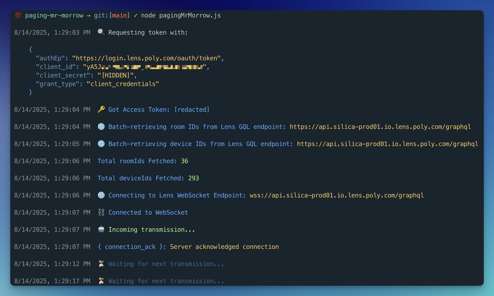
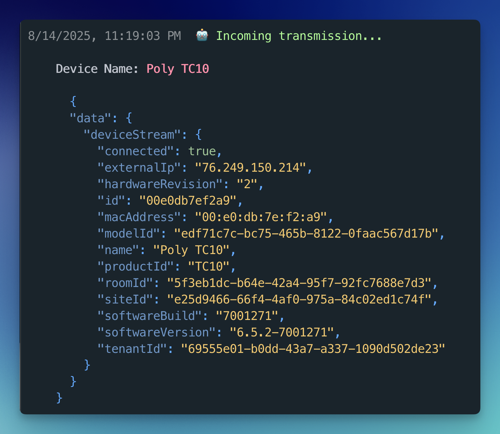
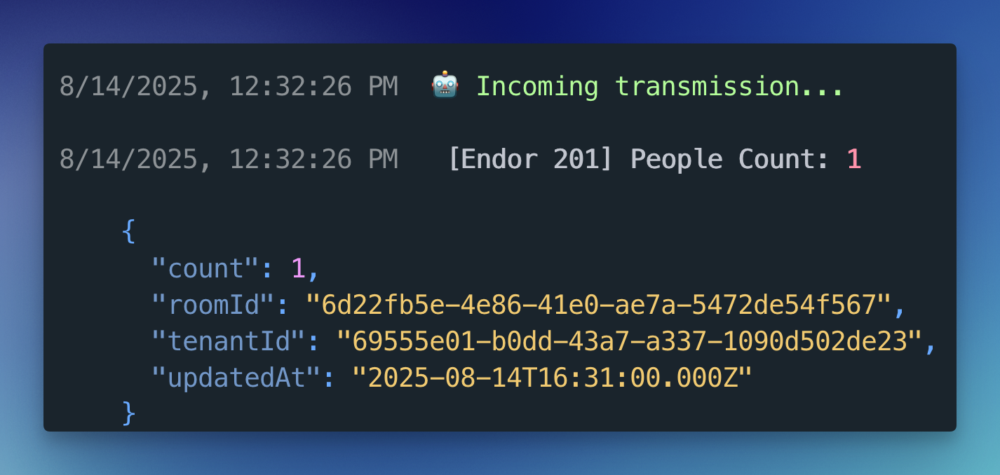

# Paging Mr Morrow

A Node.js client that connects to the Poly Lens GraphQL API via WebSocket, subscribes to real-time telemetry streams, and logs colorized data to the CLI.

---

## Features

- Connects to Poly Lens GraphQL WebSocket API (graphql-transport-ws)
  - Subscribes **after** `connection_ack`
  - Heartbeat with `ping/pong` and 30s watchdog
  - Sleep/wake drift detection (forces reconnect after wake)
  - Exponential backoff + jitter on reconnect; single in flight reconnect
- Authenticates via OAuth client credentials
- Subscribes to:
  - People Count Stream → live occupancy data for rooms
  - Device Stream → device status and telemetry
- Colorized CLI output for easy reading
- Modular code structure under utils/

---

## Project Structure

```
├── utils/
│   ├── api.js          # GraphQL API calls (fetch room IDs, etc.)
│   ├── auth.js         # OAuth token retrieval
│   ├── config.js       # Environment config
│   ├── formatter.js    # JSON color formatting for CLI
│   └── logger.js       # Colorized logging and waiting messages
├── wsClient.js         # WebSocket connection logic
├── pagingMrMorrow.js             # Entry point (AKA file you run to fire it up)
├── .env.example        # Example environment variable file
├── .gitignore          # Git ignored files
├── LICENSE
├── package.json        # NPM metadata and dependencies
├── package-lock.json   # Locked dependency versions
└── README.md
```

---

## 📦 Requirements

- Node.js >= 18+
- npm or yarn

---

## Environment Variables

Copy `.env.example` to create a local `.env`

```bash
cp .env.example .env
```

Fill in your credentials:

```bash
HTTP_URL=https://api.silica-prod01.io.lens.poly.com/graphql
WS_URL=wss://api.silica-prod01.io.lens.poly.com/graphql
AUTH_URL=https://login.lens.poly.com/oauth/token

CLIENT_ID=yourLensClientId
CLIENT_SECRET=yourLensClientSecret
TENANT_ID=yourLensTenantId
```

---

## Installation

Install dependencies using:

`npm install`

---

## Usage

Fire up the WebSocket Client:

```css
node pagingMrMorrow.js
```

You should see messages print indicating Auth credential exchange, token retrieval, room & site id fetching, and WebSocket connection/server ack:

<p align="center">
    
</p>

When a `deviceStream` message is received:

<p align="center">
    
</p>

When a `peopleCountStream` message is received:

<p align="center">
    
</p>

---

## How it Works

1. Fetch an OAuth token from Lens Auth Endpoint (using Client Credentials)
2. Uses pagination to fetch room and device IDs
3. Opens a WebSocket and sends `connection_init` with the OAuth token
4. Waits for `connection_ack`, **then** sends two `subscribe` frames:
   - `peopleCountStream`
   - `deviceStream`
5. Maintains liveness:
   - Sends protocol `ping` every 15s, expects `pong` within 30s (or reconnects)
   - Detects system sleep by clock drift and forces reconnect after resume
6. On disconnect or error:
   - For auth errors, immediately reconnect (next connection fetches a fresh token)
   - Otherwise, reconnect with exponential backoff + jitter

---

## Error Handling

- **UNAUTHENTICATED** (GraphQL error): terminate socket and reconnect
  - The next connect flow fetches a fresh token automatically
- **Network/Server Disconnect**: exponential backoff + jitter
  - 1s → 2s → 3s - up to 30s
  - Backoff resets after a successful connection
- **Heartbeat Timeout**: if `pong` isn't seen within 30s, the client tears down and reconnects
- **Invalid JSON/Protocol Errors**: logged and ignored for that frame
  - The connection stays up unless the server closes it

---

## Troubleshooting

**Fatal WebSocket Issue: `readyState 0 (CONNECTING)`**

Something tried to `ws.send(...)` before the socket opened. The client subscribes only after `connection_ack`, so you shouldn't see this unless you add custom sends outside the `open`/`message` handlers

**No data after sleep**

The client detects clock drift and reconnects automatically. If you disable the drift check, restart manually after resume.

**Too many reconnects**

Backoff + jitter are built in. You should not run multiple instances against the same tenant. Per the Lens API documentation, open one subscription per stream and pass an array of IDs. Multiple parallel clients can/will trigger throttling.
